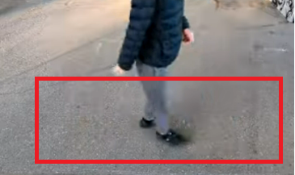
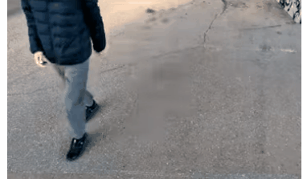
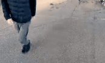
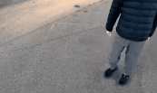
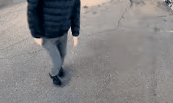
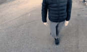
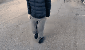

# DDS - DanceDanceShuffle
[日本語](index.md) | [English](index_EN.md) | [GitHub](https://github.com/stakiran/dds)

踏みゲーとシャッフルダンスを交えた、新しい音楽ゲームの構想

## 📍概要
DDS とは、新しい音楽ゲームのアイデアです。

### 1: 地面で二次元全域

**ノーツ表示とノーツ処理は地面上で行います**。Osu! やシンクロニカのように二次元的なフィールド全体を使います。

フィールドは横長となっており、画像のように左右を行ったり来たりします。これはシャッフルダンス的な移動を中核に据えているためです。

フィールドは奥行きもありますが、これは足を置く位置にバリエーションを持たせるためです。

### 2: ダイナミックだが易しい動き
DDS で使う動きはシャッフルダンスをベースとしたものです。ダイナミックで、遊んでいる本人も付き添いの人も双方楽しめます。

主な動きを挙げます:

ランニングマン。片足を二回ずつ引きます。

  

Tステップ。軸足を振り子のように振りながら移動させます。

シャッフルストンプ。いわゆる地団駄（交互に足踏み）ですが、軸足で重心を保っており他方の足を散らすことで踏み方や動き方のバリエーションを生み出します。

スライド。軸足を固定したまま、他方の足を等間隔で滑らせます。

クロスターン。両足をクロスさせた後、遠心力で回転します。

難しそうに見えますが、これらは容易に習得できます。DDS はゲームであってダンスではないため、 **足を動かすことさえできればいい** のです。上半身の見栄えやアイソレーションといった「ダンスの営み」は一切不要です。

また、これらの動きは厳密にリズミカルであり、刻み方も四分刻み（手拍子の速さ）または八分刻み（手拍子の二倍の速さ）となっています。音ゲーは通常、16分や32分といった速さが主流であり、これを捌くには脳の処理能力面で適性と訓練が必要です。それゆえ音ゲーはハードルの高い遊びとなっており、若者を中心とした、マニアックな層にしか受けていません。

私はこの流れを変えたいと思っています。バッティングセンターのように、万人が楽しめる音ゲーをつくりたいのです。八分刻み未満であれば、特別な適性や訓練がなくても処理できます。（リズム感覚に問題がある人以外なら）誰でも手拍子を叩けるのと同じです。

### 3: ぶっ続けにはしません
たとえば 2 分の曲があるとき、従来の音ゲーでは基本的に休みなく 2 分間処理させられます。ゲームではなくスポーツの、それも持久走のような持久的な苦しさが要求されるのです。これを安定的にこなすには高度に脱力せねばならず、これには年単位の訓練を要します。

DDS は違います。2 分の曲があるとき、処理を行うのは半分以下になります。たとえばサビの部分だけとか、冒頭とサビと終盤の 3 パートだけ、といった具合です。DDS はシャッフルダンスをベースとした動きであり、この動きは瞬発的なので、長くは保ちません。ですので、思い切って休憩を多めに入れます。

ダンスラッシュはこの点で示唆を与えてくれました。ダンスラッシュ（DANCERUSH STARDOM）はシャッフルダンスをベースとした画期的な音ゲーですが、2 分間常に処理させます。これがプレイヤーの心理的ハードルを上げていました。同じ轍は踏みません。

## 📍譜面の構成

### 待機、省力、処理
DDS ではプレイヤーの動き方が 3 種類あります。これをパートとして区別します。

- 待機パート：ノーツの処理を全く行わない時間帯。休憩
- 省力パート：シャッフルダンスの動きを使わない、ごくかんたんな処理を行う時間帯
- 処理パート：シャッフルダンスの動きを使った、処理を行う時間帯

つまり **譜面（曲に対するノーツ全体）** は待機、省力、処理の 3 つのパートから構成されることになります。たとえば 2 分の曲は、

- 15 秒の待機パート
- 30 秒の処理パート
- 15 秒の待機パート
- 30 秒の処理パート
- 15 秒の省力パート

のような構成を取ります。もちろん処理パートを続けると体力が保たないので、処理パートを待機パートや省力パートで挟み込む構成が典型です。

### 処理は長さに応じて 4 種類
15秒（ショート）、30秒（ミドル）、45秒（ロング）、60秒（スーパーロング）の 4 種類があります。これら基準の間に位置するものは、上の方に合わせます。ですので17秒の処理はミドル、35秒の処理はロングです。

DDS はシャッフルダンスの動きを使いますが、この動きは瞬発的なものであり、通常はミドルまでを使います。しかし上級者向けにはロングとスーパーロングも使えます。こちらは普通に動くだけではまず体力が持たず、意図的な休憩や省エネの戦略が要求されます。つまりロングとスーパーロングは上級者向けのものです。

このように、DDS では処理パートの長さに応じて難易度を調整できます。

以下例:

- ショート
    - [Burn!!! #DDS #DanceDanceShuffle - YouTube](https://www.youtube.com/watch?v=69Zq67DkCCQ)
- ミドル
    - [We Are Us(IOSYS TRAX Remix) ランニングマン譜面 #DDS #DanceDanceShuffle - YouTube](https://www.youtube.com/watch?v=j_mkKaCoEiY)
- ロング
    - [Gargoyle #DDS #DanceDanceShuffle - YouTube](https://www.youtube.com/shorts/xFyMxRwRw28)
- スーパーロング
    - [Restart #両面 #DDS #DanceDanceShuffle - YouTube](https://www.youtube.com/watch?v=zt7vZzEetUU)

## 📍ノーツと判定
まず一つは「踏み判定」です。**位置判定** と呼んでもいいです。Osu! やシンクロニカのように画面上（地面上）に表示したノーツを踏むという判定です。ただし、ノーツの大きさは初心者でも踏み外さないくらいには大きくします。

次に **すり足判定** です。DDS はシャッフルダンス的であり、シャッフルつまりはすり足を判定させる必要があります。これは「四分刻みや八分刻みで、足の位置が **地面と接触したまま** 変化しているか」を見ます。

さらに **向き判定** です。これはプレイヤーがどこを向いているかを判定します。上下左右があります。胴体や顔で判定するか、つま先で判定するかは検証が必要でしょう。

つまり、次のような塩梅です。

- 位置で判定する
- ただし位置判定の範囲は広めに取ることで、初心者でも踏みやすくする
- その代わり、シャッフルダンスとしてすり足判定と向き判定も設ける

これによりゲームとしての独自性と初心者でも処理しやすい難易度の双方を両立できます。

## 📍利き足
DDS には **利き足** の概念があります。野球のバッティングに左右があったり、サッカーでも蹴り足は偏ります、また e スポーツで使うマウスにも利き手があります。同様に、DDS にも利き足があるのです。

利き足とは「最初に踏み出す足」です。または「軸足ではない方の足」です。DDS では、主に利き足で踏むことになります。反対側の軸足は支える働きとして使うことが多いです。このように分担することで、何の支えがない状態でも安定して動くことができます。

利き足は DDS というゲームの成立に欠かせない概念です。したがって DDS の譜面も利き足を前提としたつくりにします。具体的には、人口の多い右利き（利き足が右足）向けに譜面をつくり、ミラーオプションにて左利き（利き足が左足）にも対応させます。

例を挙げます。利き足としてシャッフルストンプがわかりやすいです。以下を見てください。

これは BPM 185 のストンプ譜面ですが、利き足は右足です。右足を中心に踏み込んでおり、反対側の左足は軸足として支えていることがおわかりいただけるかと思います。

## 📍実現性
私は技術者や企画者の専門家ではなく、レポートレベルで実現性（フィジビリティ）を保障することはできません。しかし、すでに手札は出揃っていると感じます。

[ChatGPT 5.2Pro による実現性の考察](https://chatgpt.com/share/6973e68f-ea10-8007-b609-a518a466bc1a) を見ても、試行錯誤次第で十分稼働可能に思えます。

私自身は次のように考えています。

- 音ゲーとしての発想的・技術的実現性は Osu!、ダンスラッシュ、モーションキャプチャーによりクリアされている
- ビジネスモデルについては:
    - アーケード（ゲームセンター）及びアミューズメント施設に設置するものとし、コアな音ゲーユーザーよりも身体を動かしたい層を狙う
    - 大人向けか、子供向けかは検証してみないとわからない。個人的には子供向けの方が刺さる気がするが、楽曲の入手が版権的に厳しく高コストになる。大人向けなら版権曲ではない楽曲を使っても楽しんでもらえるため安く済む（主要な音ゲーはすでにそうしている）
    - 恥ずかしさについては演出次第で回避できる。バッティングセンターやボーリングを恥ずかしがる人はいない。どちらかと言えば「上級者が多くて初心者が近寄りづらい」構図を回避することの方が重要であり、この点は案を考えねばならない。たとえば「初心者レートのみが使える筐体」と「初心者帯を抜けた中級者以上のみが使える筐体」を分けるなど
    - 料金やプレイ時間は検証するしかない。まずは 1 クレジット 100 円、2-3 曲から始めれば良いだろう。あるいは n 分遊び放題のような時間制が良いかもしれない
    - 可能であれば中上級者向けに撮影機能あるいはモーション機能を用意する。コアな音ゲーユーザー以外のライトユーザーが SNS で共有できるようになるといい。SNS 映えとまでは言わないが、SNS による共有は口コミになる

## おわりに
DDS という新しい音ゲーのアイデアを紹介しました。

いかがでしょうか。ぜひお試しください。あるいは私を雇っても構いません。

お問い合わせはこちらまで: [お問い合わせ - stao](https://scrapbox.io/stao/%E3%81%8A%E5%95%8F%E3%81%84%E5%90%88%E3%82%8F%E3%81%9B)

## 更新履歴
- 2026-02-15 利き足について追記
- 2026-01-24 初版
